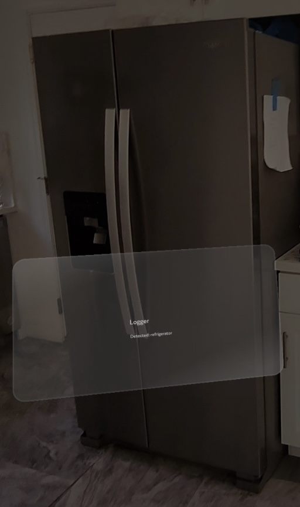
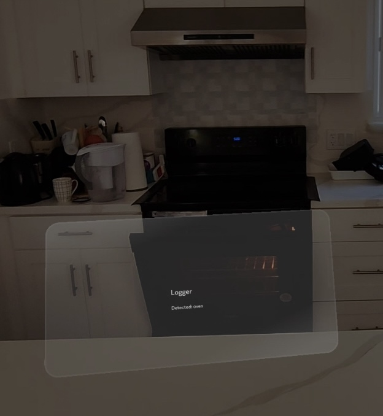
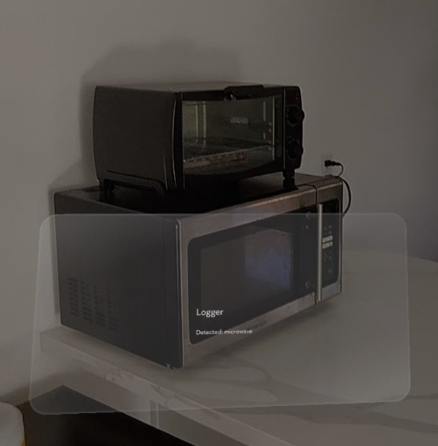

# AisleVision

## Team

| Name | GitHub | Email |
|------|--------|-------|
| Jumana Ayoub | [@jumanaayoub1](https://github.com/jumanaayoub1) | jumana.ayoub@sjsu.edu |
| Joshua Pastores | [@jjpastores](https://github.com/jjpastores) | joshua.pastores@sjsu.edu |
| Toey Lui | [@toeyldev](https://github.com/toeyldev) | toey.lui@sjsu.edu |
| Bush Nguyen | [@bush-nguyen](https://github.com/bush-nguyen) | bush.nguyen@sjsu.edu |

**Advisor:** Jun Liu

---

## Project Description

AisleVision is an Augmented Reality (AR) grocery assistant designed for Snap Spectacles. It uses computer vision to detect and track grocery items in real time while displaying an in-view checklist that helps shoppers locate items efficiently. The long-term vision is to integrate real-time object detection, smart checklist management, and indoor path planning into a hands-free shopping experience that makes navigating stores more efficient and accessible.

---

## Proof of Concept Scope
This PoC demonstrates real-time object detection running on Spectacles using a YOLOv7-tiny model deployed through SnapML, along with a checklist user interface displayed directly in the AR view. At this stage, detected objects are presented as item labels in a list.

The current PoC does not include backend or database integration, functional checklist syncing, indoor path planning, focus mode, and fully implemented 2D/3D bounding boxes around detected items in the AR environment.

---

## Prerequisites

- Snap Spectacles 24 device (SnapOS v.5.64+)
- **Desktop**: [Snap AR Lens Studio For Spectacles](https://ar.snap.com/spectacles?utm_campaign=LensStudio_PM_P0_RET&utm_content=LS_ProductPage&utm_medium=PAIDPLATFORM&utm_source=GooglePM&utm_term=Retargeting_LS_Downloaders) (v.5.15.4+)
- **Mobile**: Spectacles app
  - [iOS](https://apps.apple.com/us/app/spectacles-by-snap-inc/id6502670261)
  - [Android](https://play.google.com/store/apps/details?id=com.snap.spectacles.app&hl=en_US&pli=1)
  - Ensure Spectacles firmware is up to date via the mobile app (Check Settings → Software Update)
- Git
- macOS or Windows development machine

---

## Installation
1. Clone the repository:
   ```bash
   git clone https://github.com/SJSU-CMPE-195/group-project-team-ar.git
   ```
2. Navigate to the project folder:
   ```bash  
   cd group-project-team-ar
   ```
3. Install and open Lens Studio.
4. Pair Spectacles with the mobile app.
5. Connect Spectacles to Lens Studio.
    - **Wireless**: Ensure Spectacles and your computer are on the same WiFi network
    - **Wired**: Connect Spectacles to your computer using a USB-C cable
6. Open the `.esproj` file inside the `src/` folder.

---

## Running the PoC
1. Launch Lens Studio.
2. Click File → Open project file `src/lensstudio-snapMLstarter/lensstudio-snapMLstarter.esproj`
3. Power on and connect Spectacles to mobile app and Lens Studio.
4. In Lens Studio, Click `Preview Lens`.
5. Wait for the lens to load on the Spectacles.
6. Look through the glasses to test object detection and checklist UI.

---

## Demo

**Video:**

- [Object Detection Video Demo](https://drive.google.com/file/d/110_xQSGt6r8sHk9DzaZ3XtIHVvOLsZT6/view?usp=sharing)


**Screenshots**

- Object Detection:
  
  
  
  

- Checklist:

---

## Technical Stack

| Category | Technology |
|----------|------------|
| Frontend | Lens Studio, JavaScript |
| Backend | JavaScript, TypeScript |
| Hardware | Snap Spectacles |
| Database | Own server |
| Deployment | Snap Spectacles / Lens Studio |
| Framework | SnapML |
| ML Model | YOLOv7-tiny |

---

## What's Next (195B)
- Object Detection:
  - Add stable AR bounding boxes for detected products
  - Expand/custom train grocery detection model
  - Implement focus mode
- Add working backend/database for checklist data
- Implement item path planning and navigation
- Improve UI/UX inside Spectacles
- Add user testing and performance optimization

*CMPE 195A/B - Senior Design Project | San Jose State University | Spring 2026*
